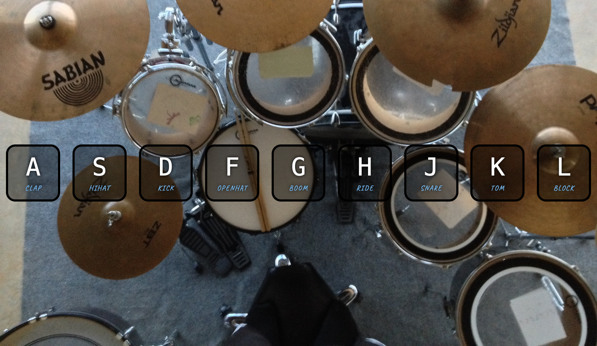

# Drum Kit - A working drumkit that you can play!

This project was originally featured on [30 Days of Javascript](https://javascript30.com) by Wes Bos. Originally a code-along exercise, I updated it to work with mobile devices and touch, in addition to PC keyboards. Coded with HTML, CSS, and Javascript. 

## Table of contents

- [Drum Kit - A working drumkit that you can play!](#drum-kit---a-working-drumkit-that-you-can-play)
  - [Table of contents](#table-of-contents)
    - [Screenshots](#screenshots)
    - [Links](#links)
  - [My process](#my-process)
    - [Built with](#built-with)
    - [What I learned](#what-i-learned)
    - [Useful resources](#useful-resources)
  - [Author](#author)

### Screenshots

### Links

- Solution URL: [Github Repo](https://github.com/ayearicks/DrumKit)
- Live Site URL: [Live Site](https://yearicks.dev/DrumKit/index.html)

## My process

### Built with

- Vanilla Javascript
- Sass
- Visual Studio Code
- Chrome

### What I learned

This was a fun project to work on. I started the building blocks of learning how to use Sass to compile my CSS. (Those nested style arguments are extremely helpful!) 

I also had to learn the difference between a click event, a key event, and a touch event. Which in the long run will be very helpful as mostly everyone uses a mobile device these days.

### Useful resources

- [Sass](https://sass-lang.com/) - Original documentation for the popular CSS compiler.
- [Mozilla Developer JS Docs](https://developer.mozilla.org/en-US/docs/Web/JavaScript) - The standard open tab when working on most things JS.

## Author

- Website - [Ashley Yearicks](https://yearicks.dev)
- Twitter - [@jessarin5](https://www.twitter.com/jessarin5)
